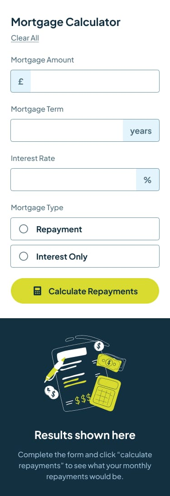

<!--  -->
<!--  -->

<!--  -->

# Frontend Mentor - Mortgage Repayment Calculator

This is a solution to the [Mortgage repayment calculator challenge on Frontend Mentor](https://www.frontendmentor.io/challenges/mortgage-repayment-calculator-Galx1LXK73). Frontend Mentor challenges help you improve your coding skills by building realistic projects. 

## Table of contents

- [Overview](#overview)
  - [The challenge](#the-challenge)
  - [Screenshot](#screenshot)
  - [Links](#links)
<!-- - [My process](#my-process) -->
  <!-- - [What I learned](#what-i-learned) -->
- [Built with](#built-with)
- [Author](#author)

## Overview

### The challenge

Users should be able to:

- Input mortgage information and see monthly repayment and total repayment amounts after submitting the form
- See form validation messages if any field is incomplete
- Complete the form only using their keyboard
- View the optimal layout for the interface depending on their device's screen size
- See hover and focus states for all interactive elements on the page

### Screenshot
  
   

#### Mobile perspective:
  - Mobile empty

  

  - Mobile completed

  

#### Desktop perspective:
  - Desktop empty

  

  - Desktop completed

  

### Built with

- Semantic HTML5 markup
- CSS custom properties
- Flexbox
- Mobile-first workflow
- @media
<!-- - @angular/animations
- @KeyFrame -->
- Angular

### Links

- Solution URL: [GitHub code solution URL](https://github.com/Kennedy-was-taken/mortgage_repayment_calculator.git)
- Live site Url : [Vercel QR code app](https://mortgage-repayment-calculator-teal.vercel.app/)

## Author

- Github Profile: [@Kennedy-was-taken](https://github.com/Kennedy-was-taken)
- Frontend Mentor : [@Kennedy-was-taken](https://www.frontendmentor.io/profile/Kennedy-was-taken)